<!-- ====================== ANIMATED HEADER ====================== -->
<div align="center">

<!-- EPIC DRAGON IMAGE -->


# 🌌 CYBER DRAGON AWAKENS 🐉


<!-- DRAGON DIVIDER -->


</div>

<!-- ====================== ANIMATED TYPING ====================== -->
<div align="center">
  
[](https://git.io/typing-svg)

</div>

<!-- ====================== SOCIAL BADGES WITH GLOW EFFECT ====================== -->
<div align="center">

[](https://github.com/nhanggwp)
[](https://www.linkedin.com/in/nh%C3%A2n-nguy%E1%BB%85n-trung-3017a02a1/)


</div>

<!-- ====================== MATRIX RAIN DIVIDER ====================== -->
<div align="center">
  
</div>

---

## 🎭 About Me - The Code Samurai


```typescript
const nhan = {
    role: "Software Engineer 🚀",
    location: "Ho Chi Minh City, Vietnam 🇻🇳",
    education: "HCMUT - Bach Khoa University 🎓",
    expertise: ["AI/OCR", "Mobile Development", "Backend Systems"],
    currentFocus: "Building AI-powered mobile solutions",
    motto: "Code is poetry, bugs are modern art 🎨",
    
    techStack: {
        backend: ["FastAPI", "PostgreSQL", "Docker"],
        mobile: ["React Native", "Expo"],
        ai_ml: ["TensorFlow", "Tesseract OCR", "TFLite"],
        languages: ["Python", "JavaScript", "TypeScript", "C++", "Java"],
        tools: ["Git", "Figma", "Mermaid", "ERD"]
    },
    
    currentlyLearning: ["Distributed Systems", "Microservices"],
    funFact: "I turn coffee into code ☕➡️💻"
};
```

<br clear="right"/>

<!-- ====================== DRAGON SEPARATOR ====================== -->
<div align="center">
  
</div>

<!-- ====================== SNAKE ANIMATION ====================== -->
<div align="center">
  
### 🐍 Contribution Snake - Watch it Eat My Commits!
  


</div>

<!-- FIRE DIVIDER -->
<div align="center">
  
</div>

---

<!-- ====================== TROPHY SHOWCASE ====================== -->
## 🏆 Trophy Case - Hall of Fame

<div align="center">
  
</div>

<!-- ====================== ACHIEVEMENTS WITH ANIMATIONS ====================== -->
## 🎖️ Achievements & Awards

<div align="center">

| 🥇 | Achievement | Project | Link |
|:---:|:------------|:--------|:-----|
|  | **Bach Khoa Innovation 2024**<br/>University-Enterprise Track | **GreenBooth**<br/>🌱 Smart Waste Sorting System<br/>TFLite Object Detection + IoT | [](https://github.com/longlephamtien/GreenBooth) |
|  | **UIT Data Science Challenge 2025** | **MediTrack**<br/>💊 AI Prescription OCR<br/>Tesseract + Drug Extraction | [](https://github.com/nhanggwp/BKU-MEDITRACK_Sourcecode) |
|  | **Bach Khoa Innovation 2025**<br/>University Track | **MediTrack Platform**<br/>📱 Full-Stack Medical App<br/>FastAPI + React Native | [](https://github.com/nhanggwp/BKU-MEDITRACK_Sourcecode) |

</div>

<!-- ====================== FEATURED PROJECTS WITH CARDS ====================== -->
## 🚀 Featured Projects

<div align="center">

<table>
<tr>
<td width="50%">

### 📱 MediTrack - AI Medical Platform
[](https://github.com/nhanggwp/BKU-MEDITRACK_Sourcecode)

**Tech Stack:**


**Features:**
- ✅ OCR Prescription Scanning
- ✅ AI Drug Name Extraction
- ✅ Health Tracking Dashboard
- ✅ Real-time Notifications

</td>
<td width="50%">

### 🧪 GreenBooth - Smart Waste System
[](https://github.com/longlephamtien/GreenBooth)

**Tech Stack:**


**Features:**
- ✅ Real-time Object Detection
- ✅ Automated Weight Measurement
- ✅ Waste Classification
- ✅ Environmental Analytics

</td>
</tr>

<tr>
<td width="50%">

### 🎓 Tutor Support System
**Full-Stack Education Platform**


- 📊 Complex ERD Design
- 🔐 Role-based Access Control
- 📈 Progress Tracking
- 💬 Real-time Communication

</td>
<td width="50%">

### 💼 HireMatch - CV Ranking
**AI-Powered Recruitment Tool**


- 🤖 Automated CV Parsing
- 📊 ML-based Ranking
- 🔍 Smart Job Matching
- 📧 Recruiter Dashboard

</td>
</tr>
</table>

</div>

---

<!-- ====================== TECH STACK WITH ANIMATIONS ====================== -->
## 🛠️ Tech Arsenal - My Weapons of Choice

<!-- CODING GIF -->
<div align="center">
  
</div>

<div align="center">

### 💻 Languages


### 🚀 Frameworks & Libraries


### 🗄️ Databases & Tools


### 🧠 AI/ML & Specialized


</div>

<!-- ====================== SKILL ICONS WITH ANIMATION ====================== -->
<div align="center">
  
</div>

---

<!-- ====================== GITHUB STATS WITH ANIMATIONS ====================== -->
## 📊 GitHub Analytics - The Numbers Speak

<!-- STATS GIF -->
<div align="center">
  
  
  
  
  
  
</div>
<br/>

<div align="center">
  
  
</div>

<div align="center">
  
</div>

<!-- ====================== ACTIVITY GRAPH ====================== -->
<div align="center">
  
</div>

---

<!-- ====================== CODING ACTIVITY ====================== -->
## ⏱️ Weekly Coding Stats

<!--START_SECTION:waka-->
```text
Python       12 hrs 30 mins  ████████████░░░░░  45.2%
TypeScript    8 hrs 15 mins  ████████░░░░░░░░░  29.8%
JavaScript    4 hrs 10 mins  ███░░░░░░░░░░░░░░  15.1%
SQL           1 hr 45 mins   █░░░░░░░░░░░░░░░░   6.3%
Other         1 hr 00 mins   ░░░░░░░░░░░░░░░░░   3.6%
```
<!--END_SECTION:waka-->

---

<!-- ====================== CONTRIBUTION GRAPH ====================== -->
## 📈 Contribution Graph - My Journey

<div align="center">
  
</div>

<div align="center">
  
  
</div>

---

<!-- ====================== SKILLS RADAR CHART ====================== -->
## 🎯 Skill Levels - Power Chart

```mermaid
%%{init: {'theme':'dark'}}%%
graph TD
    A[Nguyen Trung Nhan] --> B[Backend Development]
    A --> C[Mobile Development]
    A --> D[AI/ML]
    A --> E[Database Design]
    
    B --> B1[FastAPI ⭐⭐⭐⭐⭐]
    B --> B2[PostgreSQL ⭐⭐⭐⭐⭐]
    B --> B3[Docker ⭐⭐⭐⭐]
    
    C --> C1[React Native ⭐⭐⭐⭐⭐]
    C --> C2[Expo ⭐⭐⭐⭐⭐]
    C --> C3[TypeScript ⭐⭐⭐⭐]
    
    D --> D1[TensorFlow ⭐⭐⭐⭐]
    D --> D2[OCR ⭐⭐⭐⭐⭐]
    D --> D3[TFLite ⭐⭐⭐⭐]
    
    E --> E1[ERD Design ⭐⭐⭐⭐⭐]
    E --> E2[SQL ⭐⭐⭐⭐⭐]
    E --> E3[Data Modeling ⭐⭐⭐⭐]
    
    style A fill:#00eaff,stroke:#f72585,stroke-width:4px
    style B fill:#f72585,stroke:#00eaff,stroke-width:2px
    style C fill:#7c00ff,stroke:#00eaff,stroke-width:2px
    style D fill:#00f0ff,stroke:#00eaff,stroke-width:2px
    style E fill:#ff006e,stroke:#00eaff,stroke-width:2px
```

<div align="center">



</div>

---

<!-- ====================== CURRENT STATUS ====================== -->
## 🔥 Current Status - What I'm Up To

<div align="center">

| 🎯 Focus Area | 📚 Learning | 🚀 Building |
|:--------------|:-----------|:------------|
| **Distributed Systems** | Microservices Architecture | P2P File Sharing Network |
| **AI/ML Integration** | Advanced OCR Techniques | MediTrack V2.0 |
| **Mobile Performance** | React Native Optimization | Real-time Chat System |
| **System Design** | Scalability Patterns | Cloud-Native Applications |

</div>

---

<!-- ====================== LATEST BLOG POSTS ====================== -->
## 📝 Latest Blog Posts

<!-- BLOG-POST-LIST:START -->
- 🔥 [Building Production-Ready FastAPI Applications](https://dev.to/)
- 🚀 [React Native: Performance Optimization Tips](https://dev.to/)
- 🧠 [OCR with Tesseract: A Complete Guide](https://dev.to/)
- 💻 [Distributed Systems: P2P Networks Explained](https://dev.to/)
<!-- BLOG-POST-LIST:END -->

---

<!-- ====================== CONNECT WITH ME ====================== -->
## 🌐 Let's Connect - Find Me Across The Web

<div align="center">

<!-- HANDSHAKE GIF -->

<br/><br/>

[](https://github.com/nhanggwp)
[](https://www.linkedin.com/in/nh%C3%A2n-nguy%E1%BB%85n-trung-3017a02a1/)
[](mailto:nhan.nguyen@example.com)
[](https://your-portfolio.com)

</div>

---

<!-- ====================== QUOTES ====================== -->
<div align="center">
  
### 💭 Random Dev Quote
  


</div>

---

<!-- ====================== SUPPORT ====================== -->
## ☕ Support My Work

<div align="center">

<!-- COFFEE GIF -->


<br/>

If you find my projects helpful, consider buying me a coffee! ☕

[](https://www.buymeacoffee.com/nhanggwp)
[](https://paypal.me/nhanggwp)

</div>

---

<!-- ====================== VISITOR COUNT & FOOTER ====================== -->
<div align="center">

### 👁️ Profile Visitors


---

### 🎮 Fun Fact

<!-- GAMING GIF -->


```python
while(True):
    coffee = drink_coffee()
    code = write_awesome_code()
    if code.is_perfect():
        deploy()
        break
    else:
        debug()
        repeat()
```

<!-- FOOTER DRAGON -->


---


**Made with 💖 and lots of ☕ by Nguyen Trung Nhan**

</div>

<!-- ====================== BADGES COLLECTION ====================== -->
<div align="center">


</div>
